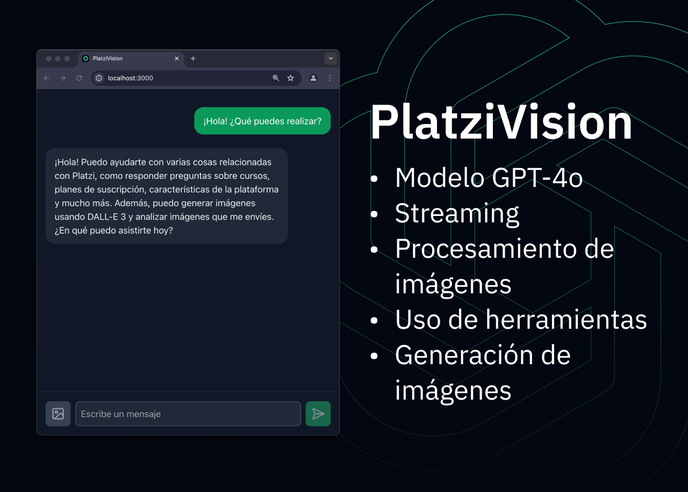

<h1 align="center">💡 PlatziVision 💻</h1>

<p align="center">
  PlatziVision es un chatbot que puede responder preguntas en tiempo real, analizar múltiples imágenes y generar imágenes utilizando DALL·E 3
</p>



👋 ¡Hola! Este repositorio contiene el proyecto final del curso de OpenAI API. Puedes empezar [instalando el proyecto](#instalación) y luego [revisar los commits por clase](#commits-por-clase).

## 🚀 Instalación

1. Clona el repositorio

```bash
git clone https://github.com/platzi/platzivision.git
```

2. Instala las dependencias de la interfaz web e inicia el servidor

Empieza desde la carpeta `platzi-vision-ui`

```bash
cd platzi-vision-ui
npm install
npm run dev
```

3. Crea el entorno virtual para la API

Empieza desde la carpeta `platzi-vision-api`

```bash
cd platzi-vision-api
python -m venv env
source env/bin/activate
```

4. Instala las dependencias de la API

Recuerda que usamos la librería OpenAI en su versión 1.55.3.

```bash
pip install -r requirements.txt
```

5. Inicia el servidor de la API

```bash
python app.py
```

¡Listo! Ahora tenemos el servidor web corriendo en http://localhost:3000 y el servidor de la API en http://127.0.0.1:5000. Con esto ya podemos empezar con las tareas pendientes para completar el proyecto:

1. Procesar los mensajes de la interfaz
2. Retornar la respuesta vía streaming
3. Agregar soporte de imágenes
4. Agregar una función de generación de imágenes

## 🎄 Commits por clase

Puedes copiar el comando de cada commit y pegarlo en tu terminal para revisar el código avanzado de cada clase.

| Clase                                                | Commit                | Cambios                                                   |
| ---------------------------------------------------- | --------------------- | --------------------------------------------------------- |
| Integración de GPT-4o con streaming en PlatziVision  | `git checkout 9875f7` | Integración de respuestas con transmisión en tiempo real  |
| Soporte de procesamiento de imágenes en PlatziVision | `git checkout 7e2f9c` | Soporte para el procesamiento de imágenes.                |
| Generación de imágenes con DALL·E 3\*                | `git checkout c9ed81` | Añade la función de generación de imágenes.               |
| Generación de imágenes en PlatziVision               | `git checkout 45bdda` | Integración de generación de imágenes usando herramientas |

\* La clase de _Generación de imágenes con DALL·E 3_ se realizó en el repositorio de `/curso-openai-api`, pero se incluye aquí como referencia que la integramos dentro de la siguiente clase _Generación de imágenes en PlatziVision_.

## 📚 Estructura del proyecto

PlatziVision se compone de 2 partes: una interfaz web y una API. La interfaz web es una aplicación web basada en Next.js que nos permite interactuar con el chatbot. La API es un servidor en Flask que se encarga de procesar las solicitudes de la interfaz web y de interactuar con la librería de OpenAI para las siguientes funcionalidades:

- Respuesta a preguntas en tiempo real (vía streaming)
- Procesamiento de múltiples imágenes
- Generación de imágenes
